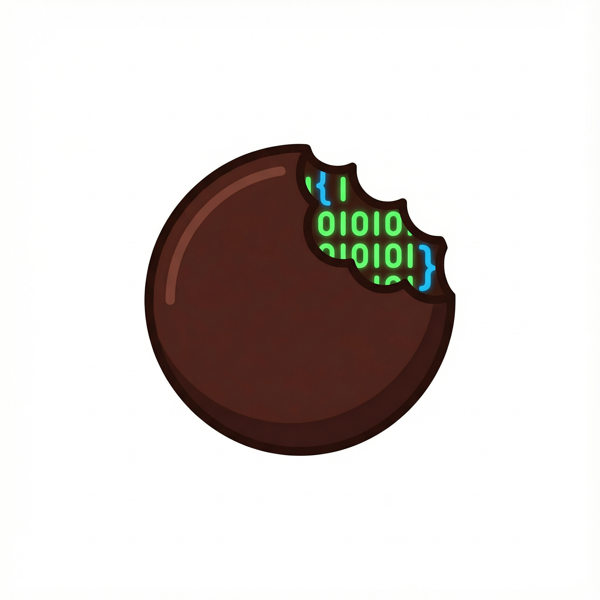

 # 🌲 ChocoVine

**Stop stressing. Start vibing.**
Coding should be as easy (and sweet) as eating a piece of cake.



## The Problem with Vibe Coding

AI coding assistants are powerful, but they come with real challenges:

1. **Prompt engineering is hard** — You spend more time crafting the perfect prompt than building
2. **It's a black box** — You can't see what Claude is doing or catch mistakes early
3. **Context fills up fast** — Quality degrades as conversations grow longer

## Our Solution: RQPIV Workflow

> **R**esearch → **Q**uestion → **P**lan → **I**mplement → **V**alidate

- **Claude asks YOU questions** — No more guessing the perfect prompt
- **Every step is visible** — See the plan before code is written
- **Sub-agents preserve context** — Research runs separately, keeping your main conversation clean

## Getting Started

Simply clone this repository:

```bash
git clone https://github.com/vneseyoungster/ChocoPine.git
```

## How to Use It

### The Simple Way

```
/start Add a login page with user authentication
```

Claude handles the full workflow automatically—researching your codebase, asking you clarifying questions, showing you the plan, implementing, and validating.

### Step-by-Step Control

```
/research Add a shopping cart    # Research, ask questions, create plan
/execute Add a shopping cart     # Execute the approved plan
/code-check Add a shopping cart  # Run code review, tests, security audit
```

### Quick Fixes

For small, known problems (bug fixes, typos, config changes):

```
/quick-fix Fix the null pointer in UserService.getProfile()
```

This skips planning entirely—main agent gathers minimal context and implements the fix directly.

## What Actually Happens

| Command | Phase | What Claude Does | What You Do |
|---------|-------|------------------|-------------|
| `/research` | **Research** | Explores codebase structure, patterns, conventions | Wait (sub-agents preserve your context) |
| `/research` | **Question** | Asks specific questions about requirements | Answer to refine the feature spec |
| `/research` | **Plan** | Creates architecture and implementation plan | Review and approve before coding |
| `/execute` | **Implement** | Writes code following the approved plan | Watch and intervene if needed |
| `/code-check` | **Validate** | Runs code review, tests, security audit | Confirm everything works |

## Why This Works

- **No more prompt guessing** — The questioning phase extracts what you actually need
- **No more confusion** — Every phase produces visible artifacts in `docs/`
- **No more context degradation** — Sub-agents keep your main context clean
- **No more surprises** — You approve the plan before implementation begins

## Commands Reference

| Command | Purpose | When to Use |
|---------|---------|-------------|
| `/start [task]` | Full workflow | Most features - runs research, execute, and validate automatically |
| `/research [task]` | Research + Question + Plan | When you want to review the plan before implementation |
| `/execute [task]` | Implementation | After `/research` to implement the approved plan |
| `/code-check [task]` | Validation | After `/execute` to run code review, tests, and security audit |
| `/quick-fix [problem]` | Fast fixes | Bug fixes, typos, config changes where solution is known |

## Configuration

Edit `CLAUDE.md` to tell Claude about your project:
- Tech stack (language, framework, database)
- Build commands
- Code conventions
- Directory structure

The more context you provide upfront, the better the results.

## Requirements

- Claude Code version 1.0.124+
- Sub-agent support enabled

## Documentation

- [Full Workflow Documentation](RQPIV-Workflow-PRD.md)
- [Quick Reference](CLAUDE.md)

## License

MIT

---

Built for [Claude Code](https://claude.ai/claude-code)
